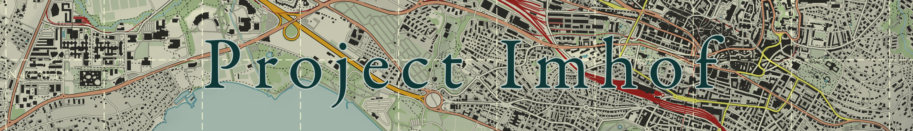
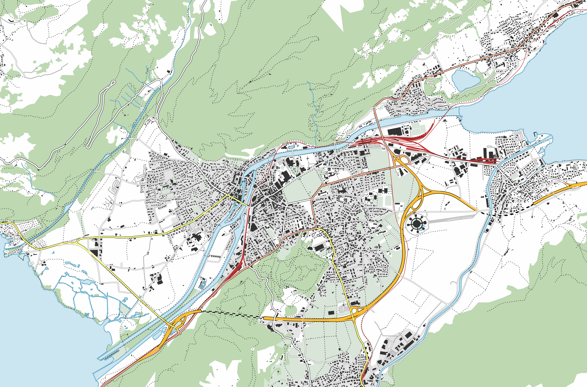
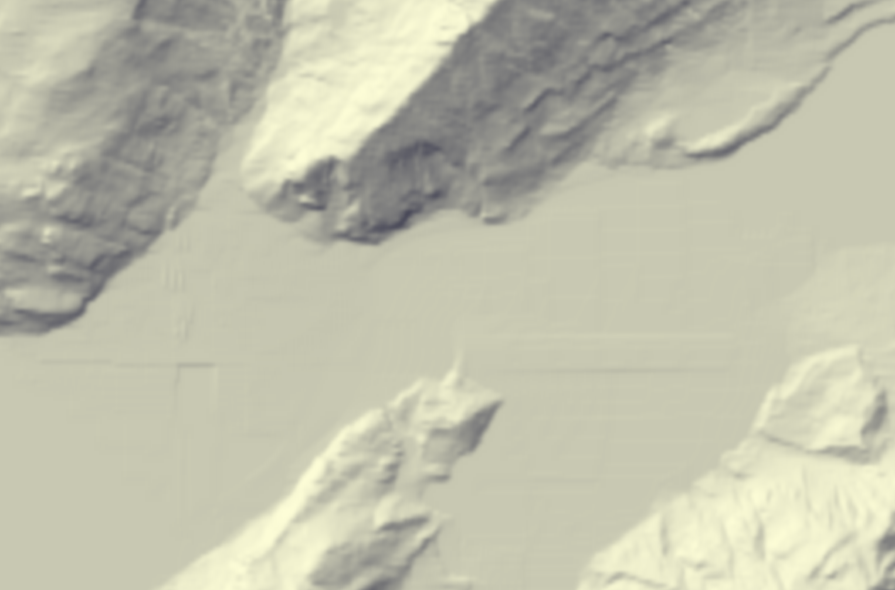
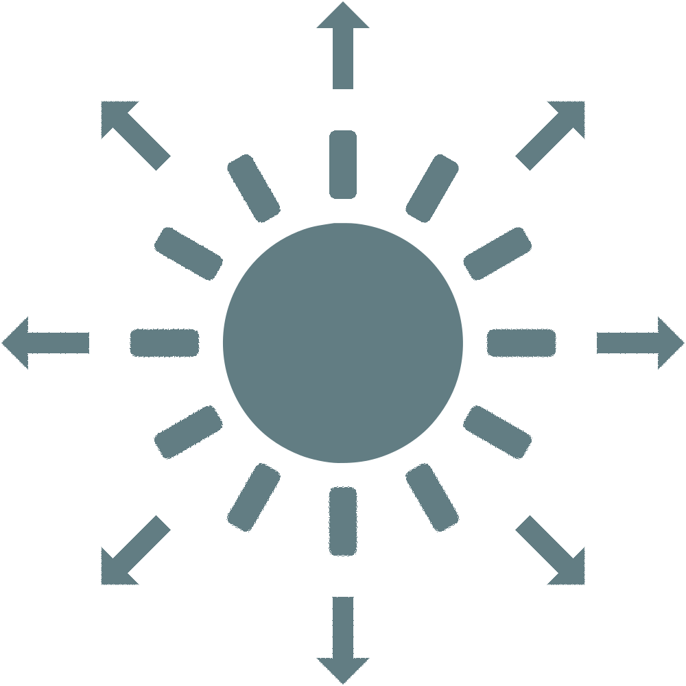
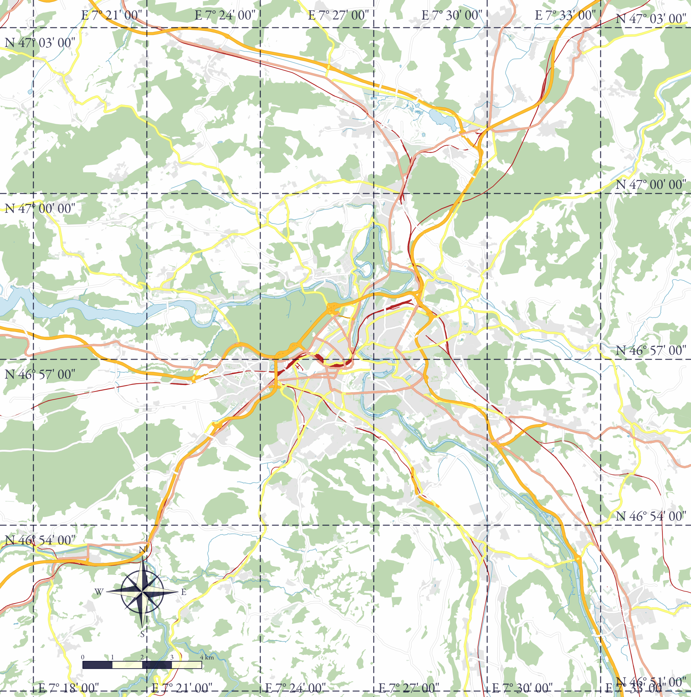

<p align='center'></p>

* [Introduction](#introduction)
* [High-level overview](#high-level-overview)
* [How to use](#how-to-use)
  * [Building](#building)
  * [Running](#running)
  * [Additional parameters](#additional-parameters)
* [Gallery](#gallery)
* [References](#references)

## Introduction

Project Imhof is a map generator in Java based on [OpenStreetMap](https://www.openstreetmap.org/) and HGT elevation files.
The maps are generated following the standard style of the national maps of Switzerland, but the style can easily be modified.
It was developed in 2015 as a group project for the [EPFL](https://www.epfl.ch/en/) Practice of Object-Oriented Programming course (CS-108).

See the [gallery](#gallery) section for examples of generated maps.

## High-level overview

The implementation reads the OSM input file and builds an intermediate representation of the objects using only the needed data.
Objects go through multiple projections and changes of coordinates to go from geographical coordinates to coordinates on a digital canvas.
An easily customizable painter is used to draw the objects in the right order, producing an image like the one below on the left.

The implementation then reads the HGT input file and draws a slightly blurred elevation model, like the image below on the right.

Finally, the two images are combined to produce the final map, like the large image below.

<p align='center'>




</p>
<p align='center'></p>

## How to use

### Building

The project is written in Java 8, so you must have JDK 8 or higher installed.
To build the project, you can use the following command:

```shell
rm -rf build &&
    mkdir build &&
    javac $(find src -name '*.java') -d build
```

### Running

The program takes the following parameters:

```shell
java -classpath build ch.epfl.imhof.Main \
    <input-osm-file-path> <input-elevation-file-path> \
    <west-longitude> <south-latitude> <east-longitude> <north-latitude> \
    <resolution> \
    <output-file-path> [<additional-argument>...]
```

See the [additional parameters](#additional-parameters) section for more details on the available additional parameters.

The project resources include OSM files for 3 swiss cities (Interlaken, Lausanne and Bern) as well as two elevation files covering all of Switzerland.

Maps for these 3 cities can be generated by running the program with the following parameter combinations:

```shell
# To generate a map of Interlaken 
java -classpath "build:res" ch.epfl.imhof.Main \
    interlaken.osm.gz N46E007.hgt \
    7.8122 46.6645 7.9049 46.7061 \
    300 \
    output/interlaken.png
```

```shell
# To generate a map of Lausanne (note the use of a different HGT file)
java -classpath "build:res" ch.epfl.imhof.Main \
    lausanne.osm.gz N46E006.hgt \
    6.5594 46.5032 6.6508 46.5459 \
    300 \
    output/lausanne.png
```

```shell
# To generate a map of Bern 
java -classpath "build:res" ch.epfl.imhof.Main \
    berne.osm.gz N46E007.hgt \
    7.3912 46.9322 7.4841 46.9742 \
    300 \
    output/berne.png
```

### Additional parameters

The following additional parameters are available:

```shell
lightfrom=<angle>
        Specifies the angle, in degrees, from which sunlight is emitted, with 0 representing sunlight coming from the north, going counter-clockwise.
        If the angle is not specified, light will be emitted from 45° (from north-west to south-east).
        Has no effect if the 'no-relief' parameter is specified.

grid=<color>
        Draws a grid with longitude/latitude lines over the map.
        Possible color arguments are 'light' and 'dark'.

legend
        Draws a legend box at the bottom right of the map.

compass
        Draws a compass at the bottom left of the map (over the scale if also specified).

scale
        Draws a scale at the bottom left of the map (under the compass if also specified).

no-relief
        Generates a map without elevation.
        Parameters 'lightfrom' and 'relief-only' have no effect when this is specified.

relief-only
        Generates the elevation model only, without the map components.
        Has no effect when the 'no-relief' parameter is specified.

1:100_000
        Uses a special painter that is suitable for 1:100'000 maps (e.g. buildings are not drawn).
```

See the [gallery](#gallery) section for examples of maps generated with different combinations of additional parameters.

## Gallery

<p align='center'>


</p>

<p align='center'>Maps of 3 swiss cities (from left to right: Interlaken, Lausanne and Bern).</p>

---

<p align='center'>

</p>
<p align='center'>

&emsp;&emsp;&emsp;&emsp;&emsp;&emsp;&emsp;&emsp;&emsp;&emsp;&emsp;&emsp;&emsp;

</p>
<br/>
<p align='center'>

&emsp;&emsp;&emsp;&emsp;&emsp;&emsp;&emsp;

&emsp;&emsp;&emsp;&emsp;&emsp;&emsp;&emsp;

</p>
<br/>
<p align='center'>

&emsp;&emsp;&emsp;&emsp;&emsp;&emsp;&emsp;&emsp;&emsp;&emsp;&emsp;&emsp;&emsp;

</p>
<p align='center'>

</p>

<p align='center'>Maps of Interlaken with different light angles, arranged as though light is emitted from the center<br/>(from bottom center going counter-clockwise: 0°, 45°, 90°, 135°, 180°, 225°, 270° and 315°).</p>

---

<p align='center'>

</p>

<p align='center'>Map of Lausanne with a grid (light), compass, scale and legend.<br/>Generated with the following coordinate parameters: <code>6.5594 46.4982 6.6808 46.5549</code>.</p>

---

<p align='center'>

</p>

<p align='center'>Same map of Lausanne as above but generated using a custom painter<br/>(replaced <code>SwissPainter</code> with <code>ExampleCustomPainter</code> in the <code>Main</code> class).</p>

---

<p align='center'>

</p>

<p align='center'>Map of Bern at 1:100'000, without elevation, with a grid (dark), compass and scale.<br/>Generated with the following coordinate parameters: <code>7.2854 46.8482 7.5899 47.0582</code>.</p>

---

<p align='center'>

</p>

<p align='center'>Elevation model of the area around Interlaken, with a grid (light).<br/>Generated with the following coordinate parameters: <code>7.7722 46.6245 7.9649 46.7461</code>.</p>

## References

Archived course project pages: [introduction](https://cs108.epfl.ch/archive/15/p00_intro.html) and [weekly deliverables](https://cs108.epfl.ch/archive/15/archive.html). 
